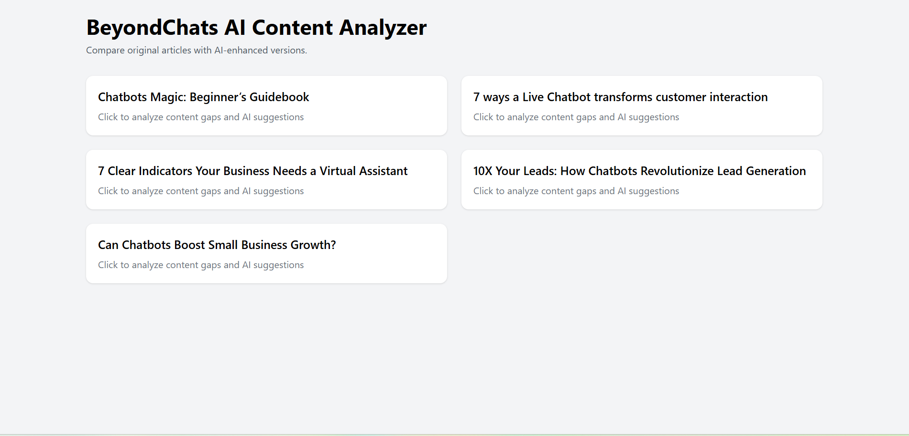

BeyondChats AI Content Analyzer

A simple yet practical tool to analyze written content by comparing original articles with AI-enhanced insights and competitor references.

This project focuses on content gap detection, AI-style improvement suggestions, and basic competitor comparison, wrapped in a clean and easy-to-use React interface.

🔍 What Problem Does This Solve?

When writing articles or blogs, it’s often hard to know:

What important topics are missing

How competitors structure similar content

What improvements could make the article more complete

This tool simulates an AI-powered content analysis workflow that highlights:

Missing topics in an article

Actionable suggestions to improve it

Related competitor articles with relevance scores

✨ Features

📄 View a list of articles

🧠 Analyze content gaps for each article

💡 Get AI-style improvement suggestions

🏆 Compare with competitor articles and relevance scores

⚡ Clean, responsive UI

🧩 JSON-based data (easy to extend or replace with backend APIs)

🛠 Tech Stack

Frontend: React (Vite)

Styling: Tailwind CSS

State Management: React Hooks

Data Source: Static JSON files (mock backend)

Architecture: Component-based, scalable structure

📁 Folder Structure (Simplified)
data/
 ├─ articles.json
 ├─ competitors.json
 └─ scrapedArticles.json
Backend/
 |-src/
 |  |-controllers/
 |  |-routes/
 |  |-services/
 |  |-utils
 |  - app.js
 |  - server.js
|-scripts/
 -scrapeBeyondChats.js
frontend-main/
 ├─ src/
 │   ├─ components/
 │   ├─ features/
 │   ├─ hooks/
 │   ├─ pages/
 │   └─ api/
 ├─ index.html
 └─ App.jsx

data/ → Acts as a mock backend

hooks/ → Custom hooks for data fetching

features/ → Core UI logic (Article list, cards, pages)

🚀 How to Run the Project

Clone the repository

git clone <repo-url>

Go to the frontend folder

cd frontend-main

Install dependencies

npm install

Start the development server

npm run dev

The app will run on:

http://localhost:5173

🧪 How It Works (Logic Overview)

Articles are loaded from JSON using a custom React hook

Clicking an article opens a detailed analysis view

Content gaps and suggestions are derived from structured data

Competitor comparison shows related titles with relevance scores

Empty states and loading states improve UX clarity
 
APIs->
http://localhost/5000/api/articles

Crud operations:
http://localhost:5000/api/articles/{id}
we can create, update, delete 
🔮 Future Improvements

Replace JSON files with real backend APIs

Integrate actual AI/NLP models for content analysis

Add authentication and user dashboards

Enable article uploads and real-time analysis

Improve scoring logic using embeddings or transformers

🧑‍💻 Author Notes

This project was built as an assignment-style implementation with a focus on:

Clean UI

Logical structure

Readable and maintainable code

AI tools were used as assistance, but all design, logic, and implementation decisions were intentional and developer-driven.

📸 Screenshots

